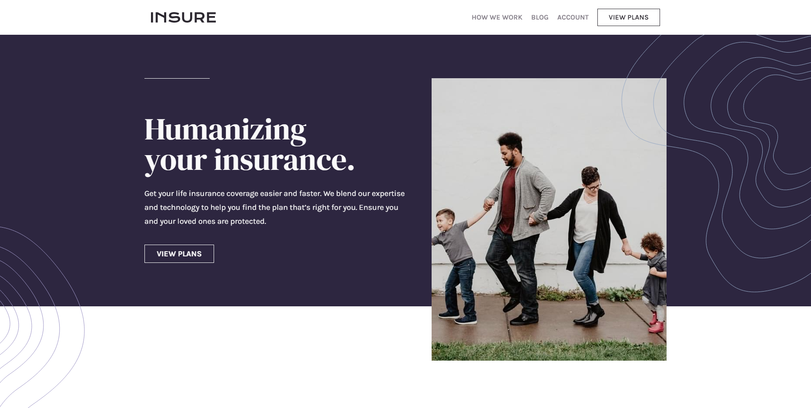

# Frontend Mentor - Insure landing page solution
This is a solution to the [Insure landing page challenge on Frontend Mentor](https://www.frontendmentor.io/challenges/insure-landing-page-uTU68JV8).
Frontend Mentor challenges help you improve your coding skills by building realistic projects. 

### Built with
- Semantic HTML5 markup
- CSS custom properties
- Flexbox
- CSS Grid
- Mobile-first workflow
- SASS
- GULP

### Screenshot

### Links
- Live Site URL: [Link](https://suaferoantjk.github.io/Insure/)

## Author
- Frontend Mentor - [@SuaferoanTJK](https://www.frontendmentor.io/profile/SuaferoanTJK)
